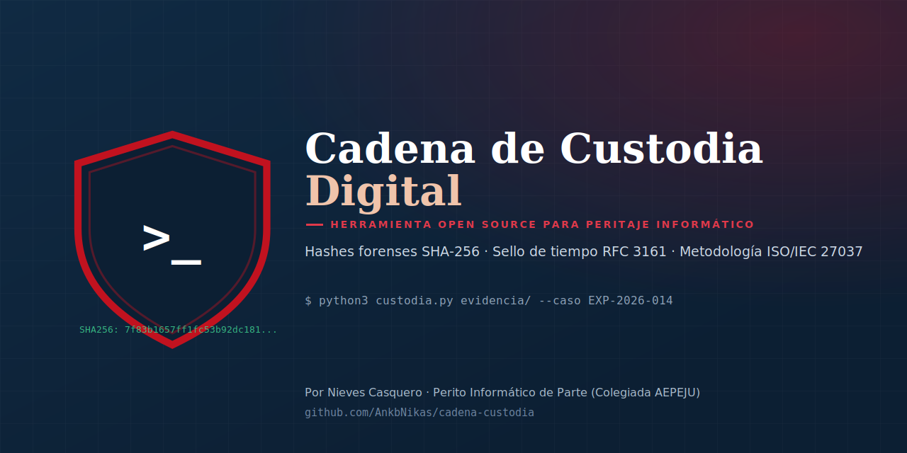

<p align="center">
  
</p>

<p align="center">
  
  
  
  
</p>

# Cadena de Custodia Digital

Herramienta de línea de comandos que genera un **acta de cadena de custodia** para evidencia digital: calcula los hashes forenses de cada archivo (SHA-256, SHA-1, MD5), documenta los metadatos relevantes, sella la integridad del conjunto y, opcionalmente, solicita un **sello de tiempo cualificado (RFC 3161)** a una Autoridad de Sellado de Tiempo.

Pensada para **peritos informáticos, analistas DFIR y equipos legales/técnicos** que necesitan documentar la adquisición de evidencia de forma trazable, reproducible y defendible ante un procedimiento judicial o extrajudicial.

## ¿Por qué existe esta herramienta?

En peritaje informático, una prueba digital solo tiene valor si se puede demostrar que **no ha sido alterada** desde el momento en que se recogió. Eso exige:

1. Un **hash criptográfico** de cada elemento de evidencia en el momento de la adquisición
2. Metadatos claros (quién, cuándo, con qué equipo)
3. Idealmente, una **fecha cierta** de esa adquisición que no dependa del reloj del propio ordenador (de ahí el sello de tiempo RFC 3161)
4. Un documento (acta) que reúna todo lo anterior de forma legible y verificable

Esta herramienta automatiza los cuatro puntos, siguiendo el esquema de referencia de la norma **ISO/IEC 27037:2012** (identificación, recolección, adquisición y preservación de evidencia digital).

## Características

- ✅ Hash **SHA-256, SHA-1 y MD5** de cada archivo, en streaming (sin cargar el archivo entero en memoria — apto para imágenes forenses grandes)
- ✅ Procesa un archivo suelto o un directorio completo de forma recursiva
- ✅ Genera un **hash del manifiesto completo** ("hash de hashes"): cualquier alteración posterior de una sola línea del acta invalida la integridad del conjunto
- ✅ Salida en **Markdown** y **PDF**, además del manifiesto en **JSON** para integraciones
- ✅ Soporte opcional de **sello de tiempo RFC 3161** contra cualquier TSA compatible
- ✅ Sin dependencias externas para la funcionalidad básica (solo librería estándar de Python)

## Instalación

```bash
git clone https://github.com/AnkbNikas/cadena-custodia.git
cd cadena-custodia
```

No requiere instalación de paquetes para el uso básico. Para generar PDF o usar el sello de tiempo:

```bash
pip install fpdf2        # opcional, para salida en PDF
pip install rfc3161ng    # opcional, para sello de tiempo RFC 3161
```

## Uso

```bash
# Uso básico sobre una carpeta de evidencia
python3 custodia.py ./evidencia --caso "EXP-2026-014" --examinador "Nieves Casquero"

# Generando también el acta en PDF
python3 custodia.py ./evidencia --caso "EXP-2026-014" --examinador "Nieves Casquero" --pdf

# Con sello de tiempo cualificado (requiere rfc3161ng y conexión a internet)
python3 custodia.py ./evidencia --caso "EXP-2026-014" --timestamp https://freetsa.org/tsr
```

Salida generada (nombre configurable con `--salida`):

| Fichero | Contenido |
|---|---|
| `acta_custodia.md` | Acta legible en Markdown, lista para incluir en un informe pericial |
| `acta_custodia.json` | Manifiesto estructurado (hashes + metadatos), para integraciones o archivado |
| `acta_custodia.pdf` | Versión PDF del acta (con `--pdf`) |

Puedes ver un [ejemplo real de salida aquí](./ejemplos/acta_ejemplo.md).

## Fundamento técnico

- **SHA-256** como hash principal (estándar actual en peritaje informático; SHA-1 y MD5 se incluyen únicamente como referencia adicional, ya que ambos están criptográficamente rotos para resistencia a colisiones)
- El **hash del manifiesto** se calcula sobre la representación JSON canónica (claves ordenadas) de toda la evidencia recogida, de modo que sella la integridad del acta completa, no solo de los archivos individuales
- El **sello de tiempo RFC 3161** no certifica el contenido de la evidencia, sino que certifica que un hash concreto existía en un momento concreto — es la misma tecnología que usan las Autoridades de Certificación para dar fecha cierta a documentos electrónicos

## Aviso legal

Esta herramienta **documenta la integridad técnica** de la evidencia digital (hashes y sello de tiempo), pero no sustituye el criterio profesional del perito ni garantiza por sí sola la validez probatoria de una evidencia mal recogida. La cadena de custodia también depende de factores no técnicos (quién tuvo acceso físico, cómo se transportó, etc.) que el perito debe documentar aparte.

## Hoja de ruta

- [ ] Verificación de un acta existente (recalcular hashes y comparar)
- [ ] Firma electrónica del acta con certificado del perito
- [ ] Generación de PDF con maquetación mejorada (plantilla de informe pericial)
- [ ] Interfaz gráfica sencilla para quien no use línea de comandos

## Licencia

MIT — libre para uso profesional, modificación y redistribución. Ver [LICENSE](./LICENSE).

## Autora

**Nieves Casquero** — Perito Informático de Parte (Colegiada AEPEJU), Especialista en Ciberseguridad y Pentester

- GitHub: [@AnkbNikas](https://github.com/AnkbNikas)
- Web: [nievescasquero.github.io](https://nievescasquero.github.io)
- LinkedIn: [nieves-kaskero](https://www.linkedin.com/in/nieves-kaskero/)

Si esta herramienta te resulta útil, una ⭐ en el repositorio ayuda a que llegue a más gente del sector.
